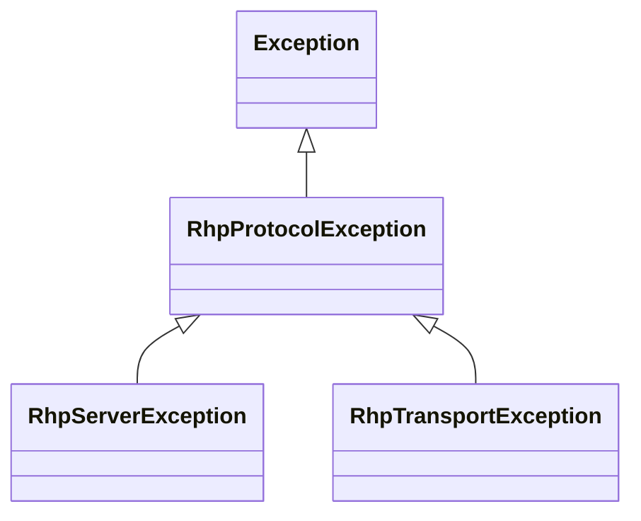

# Errors

There are three exception types you'll see from the library, all rooted
at `RhpProtocolException`.



## `RhpServerException`

Thrown when an RHP request gets a non-zero `errcode`/`errCode` reply.

```csharp
try
{
    await rhp.OpenAsync(ProtocolFamily.Ax25, SocketMode.Stream,
        port: "99", local: "G8PZT", flags: OpenFlags.Passive);
}
catch (RhpServerException ex) when (ex.ErrorCode == RhpErrorCode.NoSuchPort)
{
    Console.Error.WriteLine("Radio port 99 doesn't exist on this node.");
}
```

The exception carries:

* `int ErrorCode` — the canonical numeric code (see
  [protocol primer](../protocol.md#error-codes)).
* `string? ErrorText` — the server's `errtext`, if present.
* `RhpErrorCode.IsTransient(code)` is a useful helper for retry logic
  (returns `true` for `Unspecified`, `NoMemory`, `NoBuffers`).

## `RhpTransportException`

Thrown when the underlying TCP connection ends mid-conversation.  All
in-flight requests get this exception so callers don't hang forever:

```csharp
try
{
    await rhp.SendOnHandleAsync(h, "data\r");
}
catch (RhpTransportException ex)
{
    Console.Error.WriteLine($"link dropped: {ex.Message}");
}
```

The `Disconnected` event also fires when this happens, carrying the
underlying exception (or `null` for a clean EOS).

## `RhpProtocolException`

The base class.  You'll see it directly only for malformed JSON or for
"reply type didn't match request" mismatches — both of which generally
indicate a protocol-level bug rather than something to recover from.

## Retry guidance

```csharp
async Task<int> OpenWithRetry()
{
    var delay = TimeSpan.FromMilliseconds(200);
    for (int attempt = 1; ; attempt++)
    {
        try
        {
            return await rhp.OpenAsync(...);
        }
        catch (RhpServerException ex) when (RhpErrorCode.IsTransient(ex.ErrorCode) && attempt < 5)
        {
            await Task.Delay(delay);
            delay *= 2;
        }
    }
}
```
