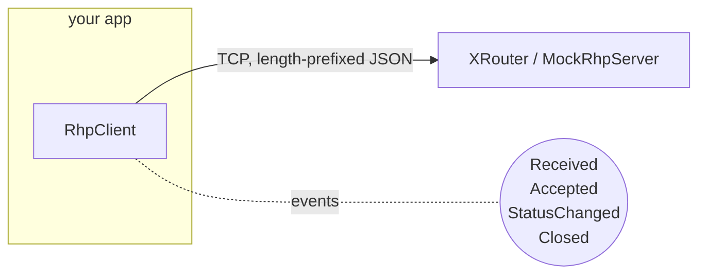

# Library overview

`RhpV2.Client` is the heart of the project — a small, dependency-free .NET
library that turns the JSON-over-TCP protocol into a strongly-typed,
async-friendly API.

## Namespace map

| Namespace                       | Contains                                              |
|---------------------------------|-------------------------------------------------------|
| `RhpV2.Client`                  | `RhpClient`, exception types, event args.             |
| `RhpV2.Client.Protocol`         | Wire-level DTOs, framing, JSON helpers, enums.        |
| `RhpV2.Client.Testing`          | `MockRhpServer` for unit / integration tests.         |

## The pieces



* `RhpClient` owns a single TCP connection.
* Each request method (`OpenAsync`, `SendOnHandleAsync`, …) auto-assigns
  an `id`, awaits the matching reply, and surfaces non-zero error codes
  as [`RhpServerException`](errors.md).
* Server-pushed messages (RECV / ACCEPT / STATUS / CLOSE) raise events.
* The read loop is fully async; no thread per connection.

## Quick tour

=== "Active connection"

    ```csharp
    await using var rhp = await RhpClient.ConnectAsync("xrouter.local");
    rhp.Received += (_, e) => Console.WriteLine(e.Message.Data);

    var h = await rhp.OpenAsync(
        ProtocolFamily.Ax25, SocketMode.Stream,
        port: "1", local: "G8PZT", remote: "GB7PZT",
        flags: OpenFlags.Active);

    await rhp.SendOnHandleAsync(h, "hello\r");
    ```

=== "Passive listener"

    ```csharp
    await using var rhp = await RhpClient.ConnectAsync("xrouter.local");
    rhp.Accepted += (_, e) =>
        Console.WriteLine($"in: {e.Message.Remote} -> child handle {e.Message.Child}");

    var listener = await rhp.OpenAsync(
        ProtocolFamily.Ax25, SocketMode.Stream,
        port: "1", local: "G8PZT", flags: OpenFlags.Passive);
    ```

=== "TRACE-mode monitor"

    ```csharp
    await using var rhp = await RhpClient.ConnectAsync("xrouter.local");
    rhp.Received += (_, e) =>
        Console.WriteLine($"{e.Message.Action} {e.Message.Srce}->{e.Message.Dest} {e.Message.FrameType}");

    var trace = await rhp.OpenAsync(
        ProtocolFamily.Ax25, SocketMode.Trace,
        port: "1",
        flags: OpenFlags.Passive
             | OpenFlags.TraceIncoming
             | OpenFlags.TraceOutgoing);
    ```

=== "Datagram (UI frame)"

    ```csharp
    await using var rhp = await RhpClient.ConnectAsync("xrouter.local");
    var sock = await rhp.OpenAsync(ProtocolFamily.Ax25, SocketMode.Dgram,
                                   port: "1", local: "G8PZT");
    await rhp.SendToAsync(sock, "BEACON\r",
        port: "1", local: "G8PZT", remote: "BEACON-1");
    ```

## Design principles

* **No third-party dependencies.**  Pure `System.Text.Json` + sockets.
* **Async to the core.**  No blocking calls, no thread-pool starvation.
* **Tolerant of spec quirks.**  Read paths are case-insensitive and
  accept both `ConnectReply` and `connectReply`.
* **Forward-compatible.**  Unknown message types arrive as
  `UnknownMessage`, never as a deserialization error.
* **Self-contained tests.**  `MockRhpServer` ships with the library so
  downstream consumers can write their own integration tests.
